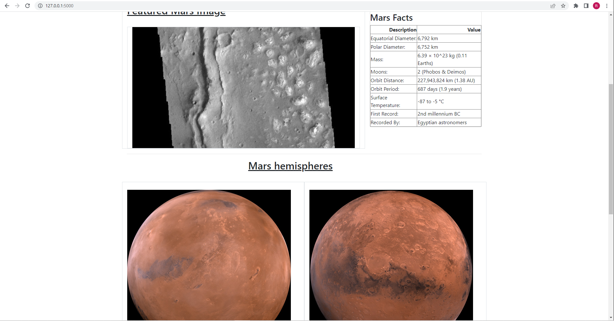

# Web Scraping Homework - Mission to Mars


In this assignment, you will build a web application that scrapes various websites for data related to the Mission to Mars and displays the information in a single HTML page. The following outlines what you need to do.


## [Scraping](missions_to_mars/mission_to_mars.ipynb)

Complete your initial scraping using Jupyter Notebook, BeautifulSoup, Pandas, and Requests/Splinter.

### NASA Mars News

* Scrape the [Mars News Site](https://redplanetscience.com/) and collect the latest News Title and Paragraph Text. Assign the text to variables that you can reference later.

```python
#Navigate to url for scraping
url = 'https://mars.nasa.gov/news/'
browser.visit(url)
time.sleep(1)

#Get browser html into object for scraping
nasa_html = browser.html

#Parse with beautiful soup parser
soup = bs(nasa_html, "html.parser")

#Scrape the Mars News Site and collect the latest News Title and Paragraph Text
#Assign the text to variables that you can reference later.
results = soup.find('div' , class_ = "list_text")

news_title = results.a.text
news_p = results.find("div" , class_ = "article_teaser_body").text
print(news_title)
print(news_p)
```

### JPL Mars Space Images - Featured Image

* Visit the url for the Featured Space Image site [here](https://spaceimages-mars.com).


```python
# Example:
featured_image_url = 'https://spaceimages-mars.com/image/featured/mars2.jpg'
```

### [Mars Facts](missions_to_mars/templates/marstable.html)

* Visit the Mars Facts webpage [here](https://galaxyfacts-mars.com) and use Pandas to scrape the table containing facts about the planet including Diameter, Mass, etc.

### Mars Hemispheres

* Visit the astrogeology site [here](https://marshemispheres.com/) to obtain high resolution images for each of Mars hemispheres.

```python
#Navigate to url for scraping
base_url  = "https://marshemispheres.com/"
browser.visit(base_url)

#Container to hold  our loop iterations
all_urls = []
t = []
#Iterate through the 4 different links to get the images needed
for x in range(4):
    html = browser.html
    soup = bs(html, "html.parser")
    
    title = soup.find_all("h3")[x].get_text()
    browser.find_by_tag("h3")[x].click()
    
    html = browser.html
    soup = bs(html, "html.parser")
    
    img_url = soup.find("img", class_="wide-image")["src"]
    all_urls.append({
        "title":title,
        "img_url": base_url+img_url
    })
    t.append({"img_url": base_url+img_url})
    browser.back()
all_urls
```

- - -

## MongoDB and [Flask Application](missions_to_mars/app.py)

Use MongoDB with Flask templating to create a new HTML page that displays all of the information that was scraped from the URLs above.


- - -

## [Website](missions_to_mars/templates/index.html)

Here are some screen shots of the fully functional website with 'scrape' button that refreshes the news and featured image of the day.





